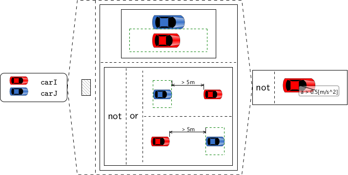
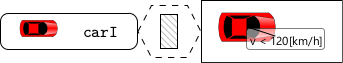
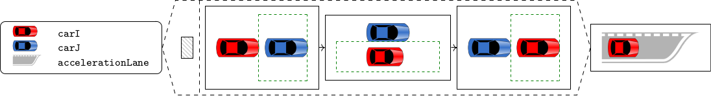
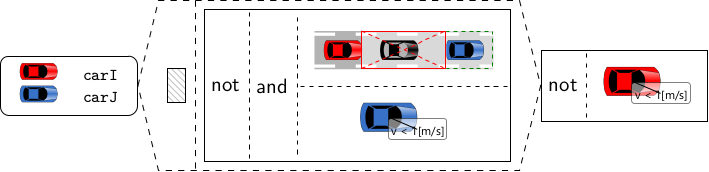
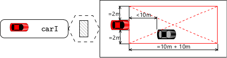
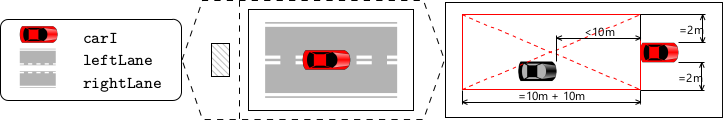
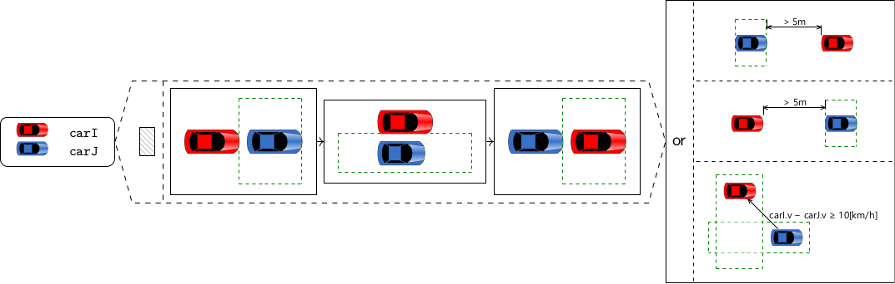
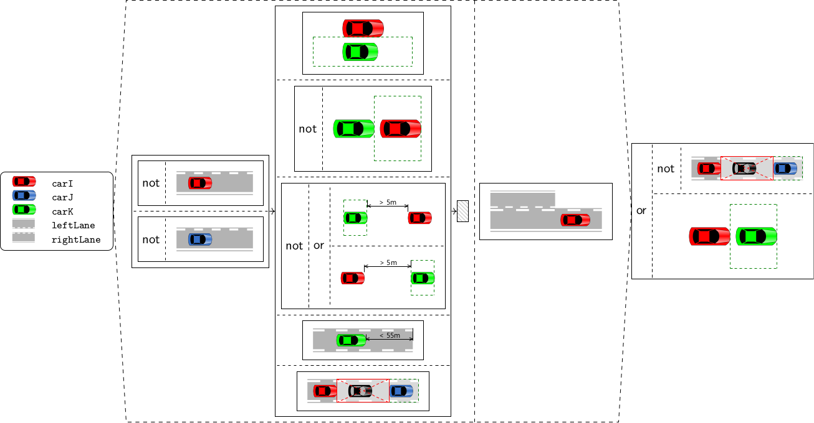

# fmas2023
This repository contains supplementary material for J. S. Becker: "Finding Real Conflicts in Traffic Sequence Charts" submitted to FMAS 2023. 

(C) 2023 DLR e. V. 

This work is licensed under a [Creative Commons Attribution 4.0 International License](https://creativecommons.org/licenses/by/4.0/).

## Repository Contents
This repository contains images of the TSCs in the case study and the SMTLib scripts for the consistency cases that have been executed for evaluation. 

The TSCs are listed in the next section. 

The file [cases.md](cases.md) lists all the consistency cases that have not been skipped and links the SMTLib scripts and expected results. For each consistency case, it contains an entry with the following information

* TSC: the top-level ("innermost") TSC in the consistency case
* T: the set of other TSCs in the consistency case
* CheckSatN(BC_1): the SMT script for CheckSatN(BC<sub>1</sub><sup>TSC,T</sup>) and the expected SMT solver response 
* CheckSatN(BC_2): same for CheckSatN(BC<sub>2</sub><sup>TSC,T</sup>); "skipped" means that the function call to CheckSatN(BC<sub>2</sub><sup>TSC,T</sup>) can be skipped (no SMT skript has been produced in this case). 
* CheckSatS(BC_2): same for CheckSatS(BC<sub>2</sub><sup>TSC,T</sup>)

You can do something like 
```[bash]
time for S in *.smt2 ; do z3 -smt2 $S ; done 
```
in a bash shell to reproduce the performance results. Z3 can be downloaded from https://github.com/Z3Prover/bin/tree/master/releases .

## Traffic Sequence Charts
The following TSCs have been used for the evaluation. 

### being overtaken


### below speed limit


### keep in right-most lane


### no passing on the right side


### no stopping


### safe distance


### safe lane change


### speed advantage for overtaking


### zipper merge


